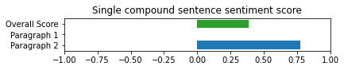
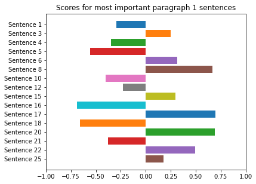
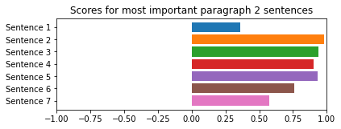

# My Response to the ACM Research Coding Challenge (Fall 2021)
Note: the old README file can be found at [README-old.md](README-old.md)

## Code
This challenge was completed in Python via a Jupyter notebook, [main.ipynb](main.ipynb).

## Methodology
In summary, I split the input text into paragraphs, used [NLTK](https://www.nltk.org) to split the paragraphs into sentences, and then used [VADER](https://github.com/cjhutto/vaderSentiment) to analyze the sentiment of each sentence. I found that analyzing each sentence individually yielded more reliable results than analyzing each sentence individually. The scores for each sentence and each paragraph were then averaged together to form a single compound score.

A more detailed explanation of the process and walk-through of my methodology can be found in [the Jupyter notebook](main.ipynb).

## Conclusions
### Sentiment score of [input.txt](input.txt)
`single_compound_sentence_score`: 0.3895

This value calculated by my code is in the range `[-1, 1]`, with values closer to 1 being
more positive and values closer to -1 being more negative. This suggests a slightly positive
sentiment, which agrees with what I would expect given my reading of the input text. More specifically,
the second paragraph was calculated to have a moderately high sentiment score, but the first paragraph had
a sentiment score of almost zero. This closely matches with my expectations, as I perceived the first
paragraph to have a neutral sentiment and the second paragraph to have a strongly positive
sentiment for an overall positive sentiment.

### Individual paragraph and sentence scores
This figure visualizes the determined sentiment score for the whole text, first paragraph, and second paragraph. Note
that the sentiment score for the first paragraph was very close to zero, and thus no bar shows
for that paragraph.

The sentiment of the most important sentences in the first and second paragraphs is shown in the
following figures.

## External Libraries Used
- [NLTK](https://pypi.org/project/nltk/)
- [matplotlib](https://pypi.org/project/matplotlib/)

## Outside resources consulted
- https://stackoverflow.com/a/49564464
- https://stackoverflow.com/a/8280500
- https://stackoverflow.com/a/23645437
- https://stackoverflow.com/a/12120412
- https://stackoverflow.com/a/18713344
- https://stackoverflow.com/a/64934457
- https://stackoverflow.com/a/46289075

- https://matplotlib.org/stable/gallery/lines_bars_and_markers/bar_stacked.html
- https://matplotlib.org/2.0.2/users/legend_guide.html
- https://matplotlib.org/stable/api/_as_gen/matplotlib.axes.Axes.legend.html#matplotlib.axes.Axes.legend
- https://matplotlib.org/stable/api/_as_gen/matplotlib.pyplot.barh.html#matplotlib.pyplot.bar
- https://matplotlib.org/stable/api/_as_gen/matplotlib.pyplot.subplots.html#matplotlib.pyplot.subplots
- https://matplotlib.org/stable/api/_as_gen/matplotlib.axes.Axes.legend.html#matplotlib.axes.Axes.legend
- https://matplotlib.org/stable/api/figure_api.html#matplotlib.figure.Figure
- https://github.com/cjhutto/vaderSentiment
- https://www.nltk.org/api/nltk.sentiment.html
- https://www.nltk.org/_modules/nltk/tokenize/punkt.html
  

- https://realpython.com/python-nltk-sentiment-analysis/
- https://towardsdatascience.com/stacked-bar-charts-with-pythons-matplotlib-f4020e4eb4a7 
- https://stackabuse.com/how-to-set-axis-range-xlim-ylim-in-matplotlib/
- https://subscription.packtpub.com/book/big-data-and-business-intelligence/9781849513265/4/ch04lvl1sec53/setting-an-axis-range
- https://www.guru99.com/tokenize-words-sentences-nltk.html

## Special thanks
Special thanks to [the research of C.J. Hutto and Eric Gilbert](https://ojs.aaai.org/index.php/ICWSM/article/view/14550) for making this sentiment analysis possible.